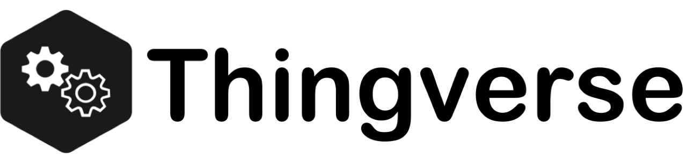

[](https://www.apache.org/licenses/LICENSE-2.0.txt)
[](https://travis-ci.org/arunkpatra/thingverse)
[](https://coveralls.io/github/arunkpatra/thingverse?branch=master)
[](https://gitter.im/thingverse/community?utm_source=badge&utm_medium=badge&utm_campaign=pr-badge&utm_content=badge)



The Thingverse platform allows virtualizing physical things. It allows you 
to interact with real things via their virtual counterparts and build higher
level functions as per your business needs. Thingverse is business domain agnostic. 
It works at extreme levels of concurrency, is self-healing, resilient and scales to
billions of things while using the minimum possible compute and memory resources. Whether running on-prem 
or on large Kubernetes Clusters in the cloud, Thingverse handles the load without breaking a sweat.

## Goals

- Virtualize physical things and provide connectivity mechanisms with real things.
- Spawn a large number of virtual things and interact with them via APIs.
- Ability to observe events associated with things and perform user specified actions.
- Build business applications on to of the Thingverse Platform.

## Getting Started

To install Thingverse:

### System Requirements (for running Thingverse)

- Memory: 4 GB minimum, 8 GB recommended
- CPU Cores: 2 Cores, 4 Cores recommended
- Kubernetes: Version 1.16+, A functional Kubernetes Cluster and `kubectl`. For local installations, you can use 
[Docker Desktop](https://www.docker.com/products/docker-desktop) which ships with a built-in single 
node Kubernetes Cluster.
- Linkerd: [Install Linkerd](https://linkerd.io/2/getting-started/).

### Installation

Pre-built docker images of Thingverse components are hosted in [Docker Hub](https://hub.docker.com/). 
While, its possible to run Thingverse components outside a Kubernetes cluster, the recommended approach 
is to run Thingverse in a Kubernetes cluster. This typically reduces development, installation and 
management efforts by 80-90%.

To install, Thingverse, start a terminal window and issue the following command:

``` 
$ kubectl apply -f https://raw.githubusercontent.com/arunkpatra/thingverse/master/subprojects/thingverse-deployment/k8s/deployments/thingverse/thingverse.yaml
```
Depending on the resources you have allocated to your Kubernetes cluster, it may take a while for all 
components to be deployed and start accepting traffic. You could issue the following command to check 
the status of the deployment:

``` 
$ kubectl get pods -n thingverse
```
Once everything is up and running, you should see responses as shown below. 
All pods should be `Ready` with a `Running` status.

``` 
NAME                                        READY   STATUS    RESTARTS   AGE
cassandra-deployment-7476c4595-275pb        1/1     Running   0          2m25s
jaeger-5c77bbb648-j8ftm                     2/2     Running   0          2m25s
thingverse-admin-794d74c574-tj4tz           2/2     Running   0          2m25s
thingverse-api-59cd4cdcb6-phgcf             2/2     Running   0          2m25s
thingverse-backend-read-5b7c9557d4-ntvdd    2/2     Running   2          2m25s
thingverse-backend-write-58577d89f4-bwfnj   2/2     Running   2          2m25s
```

### Verify Installation
- Access Spring Boot Admin: http://localhost:30095
- Access Swagger UI for APIs: http://localhost:30091
- Make a few API calls: Either use Swagger UI or use `curl`. Example API call using `curl`:
    ``` 
    $ curl -X GET "http://localhost:30091/api/cluster/state" -H "accept: */*"
    
    # You should get the following response
    
    {"allMembersUp":true,"totalNodeCount":2,"readNodeCount":1,"writeNodeCount":1}   
    ```
- Access Linkerd Dashboard: First issue `linkerd dashboard &` on a terminal window. 
Now access http://localhost:50750/namespaces/thingverse. You should be able to see your 
meshed deployments and live traffic.
- Access Jaeger UI for distributed Tracing: First issue 
`kubectl -n thingverse port-forward svc/jaeger 16686 &` on a terminal window. 
Now access http://localhost:16686. You should be able to see distributed traces that spans process boundaries.
- Access Kubernetes Dashboard: First issue `kubectl proxy &` on a terminal window. 
Then access http://localhost:8001/api/v1/namespaces/kubernetes-dashboard/services/https:kubernetes-dashboard:/proxy/#/overview?namespace=thingverse. 
You should be able to see Kubernetes resources in the `thingverse` namespace.

### Cleanup

To delete everything you just installed to your local Kubernetes cluster, you can delete the `thingverse` namespace.
``` 
$ kubectl delete namespace thingverse
```

## Getting Help
Head over to Gitter [](https://gitter.im/thingverse/community?utm_source=badge&utm_medium=badge&utm_campaign=pr-badge&utm_content=badge). If you run into problems, feel free to raise an issue.

## Trademarks and licenses
The source code of Thingverse is licensed under [Apache License 2.0](https://www.apache.org/licenses/LICENSE-2.0)

## Contributing
See [CONTRIBUTING.md](CONTRIBUTING.md) file.

## Development

If you are interested in building Thingverse from source, See [DEVELOPMENT.md](DEVELOPMENT.md)