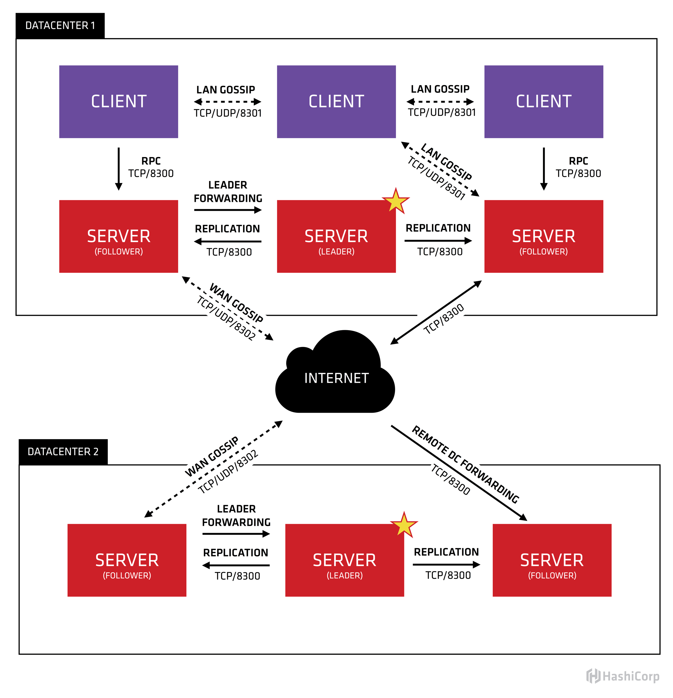

## Consul

Consul is a complex system and one should understand the basics from
 [here](https://www.consul.io/docs/internals/architecture.html) first. At a high level, the architecture looks like this.

 

### Installation

1.  Windows - Download the installer from [here](https://www.consul.io/downloads.html)
2.  macOS - You can use:
    ``` 
    brew update
    brew install consul
    ```
3.  Linux - Download the installer from [here](https://www.consul.io/downloads.html)

#### Running in Dev Server mode (Standalone)
To run Consul in standalone mode, run the following command.
```
./consul agent -dev -node machine -log-level info
```
> Note: The above command will create a Consul server in Dev mode and is sufficient if you plan to use just one
    node of Consul. In this case, you will be running all your services that point to this single consul server node.

#### Running in Cluster mode (LAN)

1.  Setup two or more physical or virtual machines with the supported OS and join all of them to the same network.
2.  Note down the IP addresses of each of the machines as handed over by the DHCP server.
3.  Create a file named `connect_consul.json` with the following content:
    ``` json
    {
      "connect": {
        "enabled" : true
      }
    }
    ```
4.  Select any one of the machines and issue the following command. This machine will host the Consul leader node for now. Use the IP address you got for `<consul_leader_ip_addr>`. Use a unique value for `<leader_node_name>`
    ``` 
    consul agent -server -ui -rejoin -bootstrap -advertise <consul_leader_ip_addr> -data-dir ~/consul/data1 -node <leader_node_name> -config-file ~/connect_consul.json
    ```
5.  On each of the other machines where you wish to run a Consul node, execute the following command. Here `<node_ip_addr>` is the IP address of the machine (not loopback address). use unique values for `<node_name>`
    ``` 
    consul agent -server -ui -rejoin -advertise <node_ip_addr> -data-dir ~/consul/data1 -node <node_name> -retry-join <consul_leader_ip_addr> -config-file ~/connect_consul.json
    ```
6.  On any of the machines, point your browser to http://localhost:8500/ to access the Consol UI.