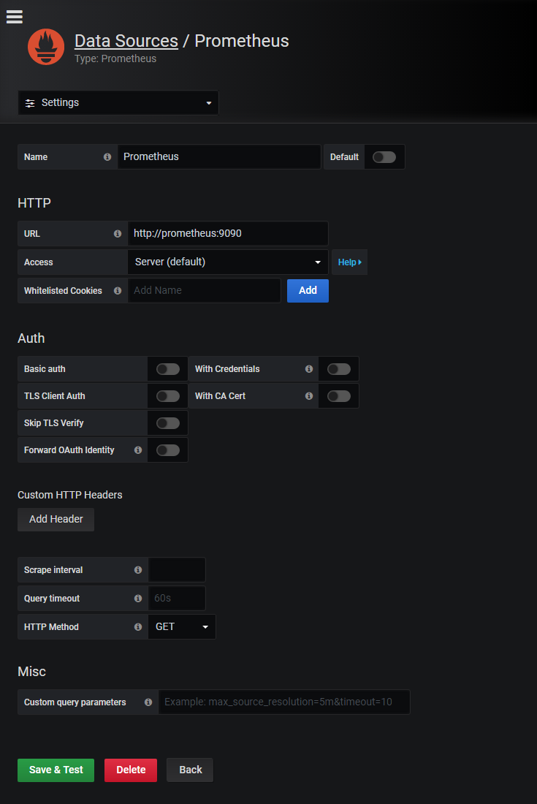
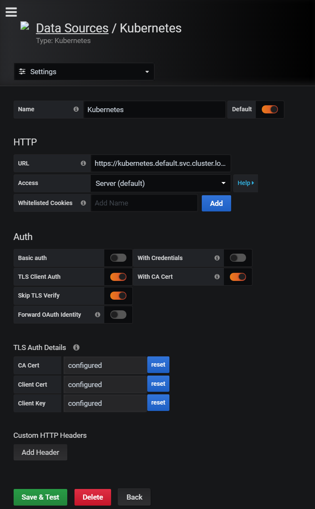

### Monitoring Stack Creation Steps

It's a long and arduous road ahead. But at the end of the road, there's sweet success.

1. Follow this guide: https://medium.com/htc-research-engineering-blog/monitoring-kubernetes-clusters-with-grafana-e2a413febefd

2. Follow these steps for authentication

3. The endpoint URL is `https://kubernetes.default.svc.cluster.local`

#### Getting the Certificates
``` 
#CA Cert 
cat ~/.kube/config | grep certificate-authority-data | cut -d ' ' -f 6 | base64 -d
#Client Cert 
cat ~/.kube/config | grep client-certificate-data | cut -d ' ' -f 6 | base64 -d
#Client Key 
cat ~/.kube/config | grep client-key-data | cut -d ' ' -f 6 | base64 -d
```
#### Prometheus DataSource Config


#### Kubernetes DataSource Config


