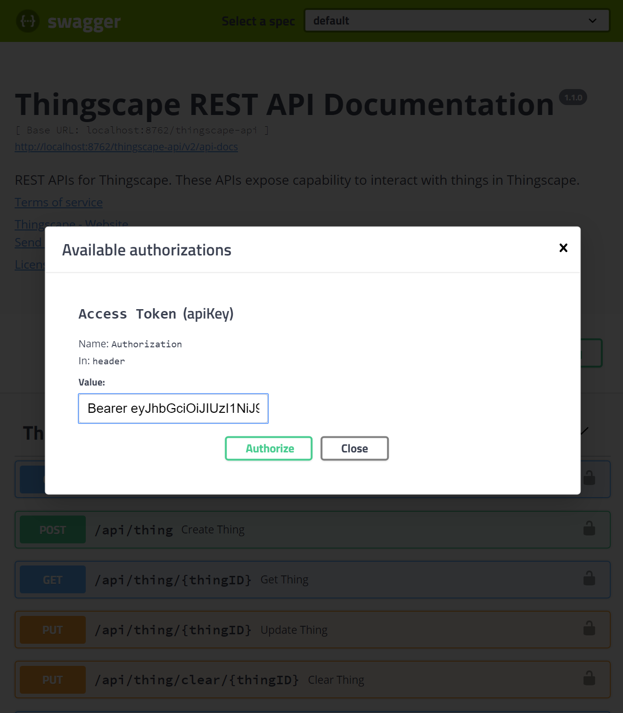

## Thingverse Monitoring

Thingverse is distributed in nature and has many moving pieces. Monitoring a distributed Thingverse installation 
requires all required sub-systems to be running correctly. These are:

1.  **Consul** This is the Service Discovery component that allows load balancing of HTTP endpoints via Zuul Proxy.
2.  **Thingverse REST API**. This exposes REST over HTTP endpoints using which you interact with the Thingverse backend 
(Akka Cluster). You should run minimum of two nodes.
3.  **Zuul Proxy**. This will load balance the REST API nodes.
4.  **Cassandra**. Thingverse Akka cluster uses Cassandra for it's journal and snapshot stores.
5.  **Thingverse Akka Cluster**. You should run a minimum of two nodes in `read-model` role and two more nodes in 
`write-model` role.

Start the components in the order mentioned above.

### Verifying Thingverse
After all your applications are up and running, do the following to verify the installation.

1.  Point your browser to http://localhost:8762/thingverse-api/swagger-ui.html. You should see the following page.

2. Now using Postman or `curl` get an authentication token.
   ``` 
   curl --header "Content-Type: application/json" \
     --request POST \
     --data '{"username":"dummy_user","password":"password"}' \
     http://localhost:8762/thingverse-api/auth/login
   ```
3.  Capture the `token` from the response and Authorize yourself in the Swagger UI. Note that you will have to specify 
`Bearer ` followed by the token the filed.

4.  Now test the `Get all thing IDs` endpoint. If your Cassandra database is clean, you should see a similar response 
as shown below.
    
5. Instead of using Swagger UI, you could also use `curl` to test the endpoint by issuing the following command.
   ``` 
   curl -X GET "http://localhost:8762/thingverse-api/api/thing" \ 
     -H "accept: */*" -H "Authorization: Bearer <your_token>"
   ```
   You should replace `<your_token>` with the actual token you had created earlier in step 2.
6.  If you get HTTP response code `200` as shown in step 4, your Thingverse installation is running ok. 
   
### Running Stress Test
Now that you have a functional Thingverse cluster up an running, its time to load up the system with some requests.
You can use [Gatling](https://gatling.io/) to generate some load. A stress test scenario is provided in the 
`thingverse-stress-tests`module and is 
available [here](../thingverse-stress-tests/src/test/scala/thingverse/BasicSimulation.scala). You should carefully 
review this fixture and tweak the `population` for the test.
```scala
val population = Seq(
   constantConcurrentUsers(20) during (120 seconds), 
   rampConcurrentUsers(10) to (1000) during (120 seconds))
```
1.  You can add more stages to the population as well. You should limit the population to something that your currently 
provisioned hardware(on which your Thingverse components are running) can sustain. Typically, for a integration test
environment, you could run Cassandra on a dedicated machine, Zuul Proxy and Eureka on another machine, two of the API 
nodes on another machine and the Akka Cluster nodes on two other machines - spreading the `read-model` and `write-model`
nodes appropriately.

2.  Next, its time to start the stress test. Navigate to the `thingverse` directory in a terminal window.
    ``` 
    cd thingverse-stress-tests
    mvn gatling:test
    ```

3.  You should see the test running and output as shown below.
    ``` 
    ================================================================================
    2020-03-28 18:42:13                                          20s elapsed
    ---- Requests ------------------------------------------------------------------
    > Global                                                   (OK=100    KO=0     )
    > Authenticate                                             (OK=40     KO=0     )
    > Create Thing                                             (OK=20     KO=0     )
    > Get Thing                                                (OK=20     KO=0     )
    > Get Thing Metrics                                        (OK=20     KO=0     )
    
    ---- Basic Test ----------------------------------------------------------------
              active: 20     / done: 20    
    ================================================================================
    
    
    ================================================================================
    2020-03-28 18:42:18                                          25s elapsed
    ---- Requests ------------------------------------------------------------------
    > Global                                                   (OK=120    KO=0     )
    > Authenticate                                             (OK=40     KO=0     )
    > Create Thing                                             (OK=40     KO=0     )
    > Get Thing                                                (OK=20     KO=0     )
    > Get Thing Metrics                                        (OK=20     KO=0     )
    
    ---- Basic Test ----------------------------------------------------------------
              active: 20     / done: 20    
    ================================================================================
    ```
4.  When the test finishes, you should see something like:
    ``` 
    Simulation thingverse.BasicSimulation completed in 253 seconds
    Parsing log file(s)...
    Parsing log file(s) done
    Generating reports...
    
    ================================================================================
    ---- Global Information --------------------------------------------------------
    > request count                                       2908 (OK=2908   KO=0     )
    > min response time                                      5 (OK=5      KO=-     )
    > max response time                                   4492 (OK=4492   KO=-     )
    > mean response time                                   109 (OK=109    KO=-     )
    > std deviation                                        339 (OK=339    KO=-     )
    > response time 50th percentile                         26 (OK=26     KO=-     )
    > response time 75th percentile                        107 (OK=107    KO=-     )
    > response time 95th percentile                        446 (OK=446    KO=-     )
    > response time 99th percentile                        745 (OK=745    KO=-     )
    > mean requests/sec                                 11.494 (OK=11.494 KO=-     )
    ---- Response Time Distribution ------------------------------------------------
    > t < 800 ms                                          2880 ( 99%)
    > 800 ms < t < 1200 ms                                   7 (  0%)
    > t > 1200 ms                                           21 (  1%)
    > failed                                                 0 (  0%)
    ================================================================================
    
    Reports generated in 1s.
    Please open the following file: C:\codebase\thingverse\thingverse-stress-tests\target\gatling\basicsimulation-20200328131151614\index.html
    [INFO] ------------------------------------------------------------------------
    [INFO] BUILD SUCCESS
    [INFO] ------------------------------------------------------------------------
    [INFO] Total time:  04:42 min
    [INFO] Finished at: 2020-03-28T18:46:08+05:30
    [INFO] ------------------------------------------------------------------------
    ```
5.  Open up the Gatling Report files in a browser as shown the file path at the end of your test. You should see the
   familiar Gatling Reports.
 
   
### Monitoring Tools

You would need to run the following components to do a successful monitoring.
1.  The user application which exposes Spring Boot Actuator endpoints. this application must expose the `prometheus` 
endpoint under the `/actuator` path.
2.  A Prometheus server instance. Prometheus will periodically scrape metrics from the user application by calling the 
endpoint `/actuator/prometheus` and store it as time series data with itself.
3.  A Grafana server instance. You configure a Prometheus DataSource in Grafana. The DataSource will pull time series 
data from the Prometheus server.

#### Monitoring on Windows

You need to install [Prometheus](https://prometheus.io/download/) and 
[Grafana](https://grafana.com/docs/grafana/latest/installation/windows/).

##### Running Prometheus

1.  Download the zip file. Important: After you’ve downloaded the zip file and before extracting it, make sure to open 
the properties for that file (right-click Properties) and select the unblock check box and then click Ok.
2.  Extract this folder to anywhere you want Prometheus to run from.
3.  In the installation folder, edit the `prometheus.yml` file and add the following content in the `scrape_configs` 
section.
    ```
        - job_name: 'spring-actuator'
          metrics_path: '/actuator/prometheus'
          scrape_interval: 5s
          static_configs:
          - targets: ['HOST_IP:8080']
    ```
    You should adjust `HOST_IP:8080` to your user application endpoint.
3.  Start prometheus by executing `prometheus.exe --config.file=prometheus.yml`
4.  Point your browser to http://localhost:9090. You can see the Prometheus UI there. But, we are going to use the 
awesome Grafana tool to see our dashboards, while using Prometheus as the time series data collection tool. However,
if you wish to, you can still use Prometheus to visualize your metrics data. Here's a screenshot.
 

##### Running Grafana
1.  Download the zip file. Important: After you’ve downloaded the zip file and before extracting it, make sure to open 
the properties for that file (right-click Properties) and select the unblock check box and then click Ok.
2.  Extract this folder to anywhere you want Grafana to run from.
3.  Start Grafana by executing `grafana-server.exe`, located in the bin directory, preferably from the command line. If 
you want to run Grafana as a Windows service, then download [NSSM](https://nssm.cc/). It is very easy to add Grafana as 
a Windows service using that tool.
4.  Point your browser and go to the Grafana port (http://localhost:3000/ is default) and then follow the instructions 
in [Getting Started](https://grafana.com/docs/grafana/latest/guides/getting_started/).
5.  You can provide `admin`/`admin` as initial credentials after which you will have to change the default password.
6.  Once you are in Grafana, you can setup a Prometheus Datasource and start configuring your dashboard. Here's an
example.
 

>  Note: The default Grafana port is 3000. This port might require extra permissions on Windows. If it does not appear 
>in the default port, you can try changing to a different port.
>  1.  Go into the conf directory and copy sample.ini to custom.ini. Note: You should edit custom.ini, never defaults.ini.
>  2.  Edit custom.ini and uncomment the http_port configuration option (; is the comment character in ini files) and 
>change it to something like 8080 or similar. That port should not require extra Windows privileges. Read more about the 
>configuration options.

#### Monitoring on macOS
You need to install [Prometheus](https://prometheus.io/download/) (download the Darwin version) and 
[Grafana](https://grafana.com/docs/grafana/latest/installation/mac/).

##### Running Prometheus
1.  Download the zip file.
2.  Extract this folder to anywhere you want Prometheus to run from.
3.  In the installation folder, edit the `prometheus.yml` file and add the following content in the `scrape_configs` 
section.
    ```
        - job_name: 'spring-actuator'
          metrics_path: '/actuator/prometheus'
          scrape_interval: 5s
          static_configs:
          - targets: ['HOST_IP:8080']
    ```
    You should adjust `HOST_IP:8080` to your user application endpoint.
3.  Start prometheus by executing `./prometheus --config.file=prometheus.yml`
4.  Point your browser to http://localhost:9090. You can see the Prometheus UI there. But, we are going to use the 
awesome Grafana tool to see our dashboards, while using Prometheus as the time series data collection tool. However,
if you wish to, you can still use Prometheus to visualize your metrics data. Here's a screenshot.
 

##### Running Grafana
1.  Before you begin, you must have [Homebrew](https://brew.sh/) installed.
2.  Execute the following commands in a terminal.
    ``` 
    brew update
    brew install grafana
    ```
3.  Start Grafana by executing `brew services start grafana`. Stop using `brew services stop grafana`. Update using 
`brew update` followed by `brew reinstall grafana`.
4.  Point your browser and go to the Grafana port (http://localhost:3000/ is default) and then follow the instructions 
in [Getting Started](https://grafana.com/docs/grafana/latest/guides/getting_started/).
5.  You can provide `admin`/`admin` as initial credentials after which you will have to change the default password.
6.  Once you are in Grafana, you can setup a Prometheus Datasource and start configuring your dashboard. Here's an
example.
 

### References

1.  See this [article](https://blog.autsoft.hu/defining-custom-metrics-in-a-spring-boot-application-using-micrometer/) 
for reference.
